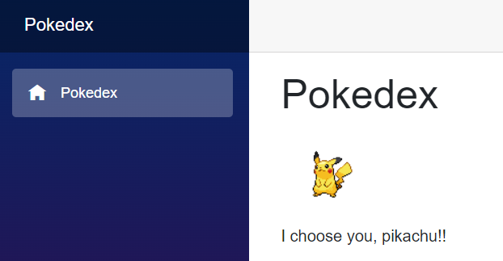
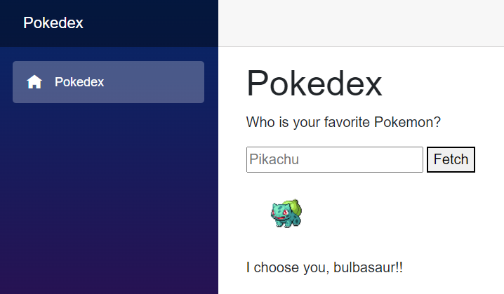

# Blazor and APIs

Now that you know how to call on an API in a console, it's time to take that information and render it to a page! A Single Page Application is arguably the best choice for working with APIs thanks to its dynamic rendering. This will save us from excessive page reloads any time we want to access our API. For this reason, we are going to take what we learned in the last section and apply it to a Blazor application.

We strongly recommend going back to the Blazor module and checking out how it works before proceeding. This tutorial will be fairly straightforward and will not require deep knowledge of how Blazor works, but if you want to take this project to the next level you will need to understand the basics.

## Getting Started

First off, we need to make a Blazor project. We will use a simple Blazor Server project to get started:

`dotnet new blazorserver -o Pokedex --no-https`

Open the project in VS Code. If you would like, you may now remove any excessive elements like anything relating to the WeatherForecast demo in the project.

We will need all those record class models we made in the last demo. In the `Data` folder of your project, create a new file called `PokemonModels.cs`. You can copy and paste the entire `Models.cs` code from the last project into here. There are no changes to be made.

The next thing we need to do is head to Program.cs. In the section where we import all our builder.Services, add the following line:

`builder.Services.AddHttpClient();`

Recall from the last project that we also used an HttpClient to aid us in connecting to our API. It will function in much the same way here.

With that, we are ready to write some code!

## Calling an API on Initialization

In this project, our aim is to create a web page where a user can see information about a specific Pokemon appear on the front page. This means first we must go talk to our API and pull data from it. Once we have the data, we can store it in a variable to render on our page. For now, we will hardcode the Pokemon we are going to grab. Later we will add some functionality to make it so we can ask for any Pokemon and have it appear on the screen.

All of our code will live in Index.razor, located in the Pages folder of your project. You can remove all references to the welcome and survey prompts. At the top of the page, add this line of code:

`@inject HttpClient Http`

This will bring in the HttpClient we asked for in Program.cs. We will need this to call on the methods we need. Next, let's add an `@code` block to the bottom of the page. This is where our logic to pull on the API will live.

```csharp
@code {
    private Pokemon? Pokemon = null;
    protected override async Task OnInitializedAsync()
    {
        var res = await Http.GetAsync($"https://pokeapi.co/api/v2/pokemon/pikachu");
        if(res.IsSuccessStatusCode)
        {
            Pokemon = await res.Content.ReadFromJsonAsync<Pokemon>();
        } else {
            Pokemon = null;
        }
    }
}
```

What have we just done here? We created a variable to hold our Pokemon object, and we used a built-in method called `OnInitializedAsync()`. This method will run in the moments before our component is rendered. It will only run one time when the page loads.

Inside, we used `await Http.GetAsync()` to pass along the API route we want to pull data from. Finally, we checked to see if we received a proper response from our API. If our response was a success, we set the new data into the Pokemon variable, making sure to convert it into a proper Pokemon object for ourselves along the way. If the request failed, we set Pokemon to equal null. We will show off in just a moment why we chose to do this.

If you take a few minutes to compare it to how we called the API in the last project, you will find the steps are not all that different from each other. There are some minor syntax differences and some missing steps compared to the first example, but that is thanks to having a service expediting the process for us.

## Rendering Data

With our Pokemon object ready to go, the next step is to render it. Rendering the data is as simple as calling on the parts of the object you want to see. The only extra step we will add is to take care of the chance that we received a bad response. This is why we started and set Pokemon to null for a bas response. We are going to check if Pokemon is null, and if it is we will render a message to let our user know there was a problem. Otherwise, we can render the Pokemon as we'd like.

```csharp
@if(Pokemon == null)
{
    <p>Unable to access Pokemon, please try again.</p>
} 
else {
    <div>
        
        <p>I choose you, @Pokemon.Name!!</p>
    </div>
}
```
Test out your code, and you should now see Pikachu's sprite and "I choose you, Pikachu!!" on the page! Congrats!



## Recalling the API

What we have is a fine example for rendering a page where we only need to talk to the API once. However, this Pokedex would be really boring if we could only ever see Pikachu. It would be better if we could ask for any Pokemon and have them rendered on the screen. This means we have to not only run our API call again, but we have to pass in variable data to determine which Pokemon we want.

Remember from working with the PokeAPI before that the URL works so long as we provide either the name of the Pokemon or its ID number. This means that in the route `https://pokeapi.co/api/v2/pokemon/pikachu` we only need to concern ourselves with the last piece `https://pokeapi.co/api/v2/pokemon/{somePokemon}`. This means we need a variable, and the value of that variable needs to come from our user, which means it's time for a form.

## Building a Form

For this example, we can get away with something very simplified. In fact, we'll hardly be building a form at all as you may recognize it. All that is important here is that we have an input box and a button to trigger the recall of our API.

To get started, in the code block of Index.razor we will add two new variables: a string for the new Pokemon and a string to track the current Pokemon.

```csharp
@code {
    private Pokemon? Pokemon = null;
	// New variables
    private string? newPokemon;
    private string currentPokemon = "pikachu";
    // other code
}
```
We will default the currentPokemon variable to Pikachu so there is something to render when the page initially loads. Now that we have our variables, we'll adjust our API call to use them:

```csharp
@code {
    private Pokemon? Pokemon = null;
	// New variables
    private string? newPokemon;
    private string currentPokemon = "pikachu";
    
    protected override async Task OnInitializedAsync()
    {
        var res = await Http.GetAsync($"https://pokeapi.co/api/v2/pokemon/{currentPokemon}");
        if(res.IsSuccessStatusCode)
        {
            Pokemon = await res.Content.ReadFromJsonAsync<Pokemon>();
        } else {
            Pokemon = null;
        }
    }
}
```
You can already test that the code works by changing currentPokemon to something else. Next, we need a way for our user to input a new Pokemon.

There is a special new feature we are going to briefly go over before we get started. It's called `@bind`, and what it can do in our forms is it "binds" to an existing variable and will update that existing variable any time a change happens within the input it is bound to. In our case, we want an input box to bind to the newPokemon variable so it can keep track of user input.

In the html section of Index, we can add the following lines:

```csharp
<p>Who is your favorite Pokemon?</p>
<input type="text" placeholder="Pikachu" @bind="newPokemon">
```
This will update newPokemon any time a user types into the input box. The last thing we need is a way to trigger our API call. We will do this with an `@onclick` command.

```csharp
<p>Who is your favorite Pokemon?</p>
<input type="text" placeholder="Pikachu" @bind="newPokemon">
<button @onclick="FetchPokemon">Fetch</button>
```
The "FetchPokemon" in the onclick is a function we have not written yet, but that we want to have trigger when we click the button. Its job will be to run the call to the API again. The code will look identical to what we wrote in OnInitializedAsync.

```csharp
@code{
    // All our variables and the OnInitializedAsync method
    private async Task FetchPokemon()
    {
        currentPokemon = newPokemon;
        newPokemon = "";
        var res = await Http.GetAsync($"https://pokeapi.co/api/v2/pokemon/{currentPokemon}");
        if(res.IsSuccessStatusCode)
        {
            Pokemon = await res.Content.ReadFromJsonAsync<Pokemon>();
        } else {
            Pokemon = null;
        }
    }
}
```

And with that, we're done! Test out the code to see that it works!



Congrats on building your first Blazor and API project! Next, spend some time rendering more data, or go find your own API and test it out here. Happy coding!

