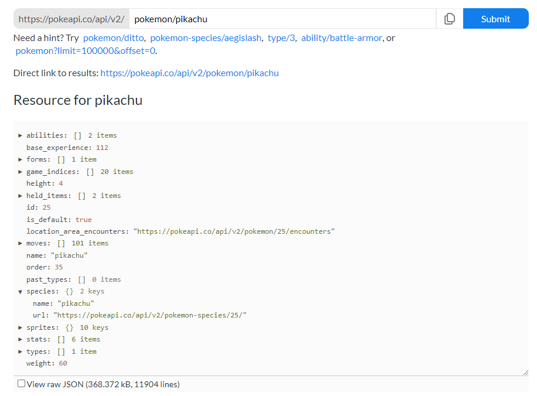

# C# and APIs

APIs (Application Programming Interfaces) are extremely common tools in programs. They act as the middleman sitting between our program and a database. The most common use you will find for an API is to use it to access data using HTTP endpoints. If you have spent any time with axios or the JavaScript stack, you have most likely encountered working with APIs using JavaScript. This makes sense. Since many APIs return JSON (JavaScript Object Notation), working with JavaScript seems like the most logical choice.

The question then becomes: how do we access and work with APIs in another language? Like C#. In this section, we will cover a basic way to access API data in C#, and then we will build our knowledge into a full-fledged application.

## A Basic Example

This first example is meant to expose you to how we might communicate with an API in C#. The biggest difference you will find when working with an API in C# versus a language like JavaScript is that C# being a type-explicit language means we have a few extra steps to go through before we can start confidently accessing our data.

We will begin by creating a new console application. We will use a console application to keep things simple for now. In your terminal, run `dotnet new console -o APITest` to create a project.

Open the project in VS Code and at the top of Program.cs we will go ahead and bring in the two using statements we will need for this project: `System.Net.Http.Headers` and `System.Text.Json`. These will help us in the initial API connection process and in handling the data when it is received.

The next step is to set up our intent to connect to an API. We will do this using HttpClient. We will create an instance of HttpClient that will set up our API headers. Your exact implementation of this may change depending on what requirements your API has for accessing it. Always read the documentation on the API you plan to use to ensure you are following its rules.

### Program.cs
```csharp
using System.Net.Http.Headers;
using System.Text.Json;
using HttpClient client = new();
client.DefaultRequestHeaders.Accept.Clear();
client.DefaultRequestHeaders.Accept.Add(
    new MediaTypeWithQualityHeaderValue("application/json"));
```

This next part will require that you have spent some time with the documentation of your API to understand the type of data you will be getting back. This is because we have to build out some classes that will fit the data we are expecting. For this example, we will use the [Pokemon API](https://pokeapi.co/) to pull data on singular Pokemon. The PokeAPI shows an excellent example of the data we can expect back from a call:



You can switch to the raw JSON format if it is easier to digest. The important things to note here are the key names available to us. There are some common elements we may want to use such as "name", "moves", or "types". For our example, we will create a project that will return the id, name, sprites, types, and moves of a single Pokemon.

Take note that some keys, like name, lead straight to a piece of data, but other keys, like moves, lead into an array containing nested objects. This will also be important to note as we build out our models.

Back in the project, create a new file at the root level called `Models.cs`. At the top of the file, we will use `System.Text.Json.Serialization`. This library will help us to pull data from the properties we want.

Our intention with this API call is to call on a single Pokemon. Therefore, the class we will create will reflect that it contains a single Pokemon. Here is how we get started:

### Models.cs
```csharp
public record class Pokemon();
```

"record" is a new term for us. These create classes specifically for encapsulating data in immutable types (like our API data). From here, we will fill in our class with just the pieces of the API data we want. We could go so far as to build out parts for every piece of data this API will send down, but this API contains a lot of nested fields, so in the essence of brevity we will only grab a few pieces we want. Once again, it is very important at this stage that you are aware of what kind of data your API is going to send down to you. Now we are going to build some fields based on that data.

For example, we said we wanted the name of the Pokemon when it comes down to us. In the documentation, it shows that the Pokemon's name is in a key simply titled "name". Here is how we're going to grab it:

```csharp
public record class Pokemon(
	[property: JsonPropertyName("name")] string Name
);
```
What did we just do? We created a string field called Name, and we established that the data for the name is coming in from a property in our API called "name". It is important that the property name inside the parentheses matches the name from the data. Let's add another one for the Pokemon's id to show another example:

```csharp
public record class Pokemon(
    [property: JsonPropertyName("id")] int Id,
	[property: JsonPropertyName("name")] string Name
);
```
Now that you've seen it twice, are you getting the pattern? Locate the property name of the data you want from the JSON result, fill it in, and give it a unique name to call it by in C#. You not only have to know what to call it by, but you also have to know what datatype it is!

So what about the "moves" property? It contains an array of data, and inside that array of data are more objects! How can we pull data that is nested? This is how: we will create another record class that will map to the data from the nested object that we want. Here is a demonstration of the "moves" property:

```csharp
public record class Pokemon(
    [property: JsonPropertyName("id")] int Id,
	[property: JsonPropertyName("name")] string Name,
    // We created an array of Moveset to hold all the data
    [property: JsonPropertyName("moves")] Moveset[] Moves
);
// We created a Moveset class to pull the move from inside the object
public record class Moveset(
    [property: JsonPropertyName("move")] GetName Move
);
// However, the "move" object itself also has nested data
// so we built ANOTHER record class to access the name inside the move object inside the moves array
public record class GetName(
    [property: JsonPropertyName("name")] string Name
);
```
Data can be nested pretty far down, which is again why it is important to know where your data is coming from. We had to dig pretty deep for this information, and when we want to access it we'll need to use the proper sequence of calls to access the move. We will demonstrate this in a bit.

For now, here is a built-out version of all the record classes we need to get the Id, Name, Types, Moves, and a few of the Sprites for a Pokemon. Take some time to look this over and draw connections between where each class is getting its data from:

```csharp
using System.Text.Json.Serialization;
public record class Pokemon(
    [property: JsonPropertyName("id")] int Id,
    [property: JsonPropertyName("name")] string Name,
    [property: JsonPropertyName("sprites")] Sprites Image,
    [property: JsonPropertyName("types")] PokeTypes[] Types,
    [property: JsonPropertyName("moves")] Moveset[] Moves
);
public record class Sprites(
    [property: JsonPropertyName("front_default")] string front,
    [property: JsonPropertyName("front_shiny")] string frontShiny,
    [property: JsonPropertyName("front_male")] string male,
    [property: JsonPropertyName("front_female")] string female
);
public record class GetName(
    [property: JsonPropertyName("name")] string Name
);
public record class PokeTypes(
    [property: JsonPropertyName("type")] GetName Type
);
public record class Moveset(
    [property: JsonPropertyName("move")] GetName Move
);
```
Now that our classes are ready, we can build the function we need to call down data from our API. Head back to Program.cs to finish things up. We will create an async function that will receive the client we built earlier and the API url we need.

Within that function, we will create what is known as a Stream. A Stream is commonly used when handling larger files to break the data into manageable chunks to increase performance and ensure smooth read and write operations. This will make it so our project is less likely to hang while waiting for data to fully transfer in from our API call.

Once we have the data, we will run it through a Json Serializer that will use the model we created as a map to fit the data to. Finally, the result will be returned as an object of our class type to make it easy to work with. Here is what that process looks like:

### Program.cs

```csharp
// Program.cs code above removed for brevity
static async Task<Pokemon> ProcessPokemonAsync(HttpClient client, string url)
{
    await using Stream stream =
    await client.GetStreamAsync(url);
    Pokemon? Result =
        await JsonSerializer.DeserializeAsync<Pokemon>(stream);
    return Result;
}
```
This function will return a Task with a Pokemon object inside of it. Though at the end of the sequence, we can simply use Pokemon as the datatype to hold our result. The way this API works is that it can accept either a number corresponding to a particular pokemon or the name of the pokemon itself at the end of its API route. Let's take a look at an example:

```csharp
// Program.cs code above removed for brevity
Pokemon OnePoke = await ProcessPokemonAsync(client, "https://pokeapi.co/api/v2/pokemon/pikachu");
Console.WriteLine($"I choose you, {OnePoke.Name}!");
```

If you test out this code now, you should get "I choose you, Pikachu!" in the terminal! Congrats! You successfully made an API call in C#! You can experiment by trying other Pokemon names (spelling matters!) or numbers. Special note: as of writing this (early 2023), you can type in a number between 1 and 1008. Then after that other valid results are between 10001 and 10271. This decision was likely made because past 1008 it goes into alternate forms for existing Pokemon and the devs probably wanted to leave room for new Pokemon in between.

Now that you've seen how to access and pull data from the API, try it yourself! Add some new properties and classes and try to dig into the existing data. For example, here is how we would display all the types of a Pokemon (this works best when you have a Pokemon with multiple types, like Bulbasaur):

```csharp
// Program.cs code above removed for brevity
Pokemon OnePoke = await ProcessPokemonAsync(client, "https://pokeapi.co/api/v2/pokemon/bulbasaur");
foreach(PokeTypes t in OnePoke.Types)
{
    Console.WriteLine($" - {t.Type.Name}");
}
```
Do you understand how we got to this result? Put the models next to this example if you need to track how we arrived at this syntax.

A couple of challenges for you before we wrap up this demo:

1. All the data we get comes back in lowercase. How can you make it so it prints the name of the Pokemon with the first letter capitalized? (i.e. Pikachu instead of pikachu)
2. Can you write some logic that pulls out 4 random moves from the moves array and render them to the terminal?
3. Make this project more interactive: use Console.ReadLine() (from way back at the start of this course) to accept user input for a number or Pokemon name and then render the correct information to the terminal (i.e. if the user types "4" we should see data on the Pokemon Charmander. If they type "Articuno" we should see information on the Pokemon Articuno.)

From here, you can try on your own to figure out how to get this information to a webpage to render (after all, those sprites aren't much use as just text!) But if you want to learn how to do it with Blazor, head to the next section.


