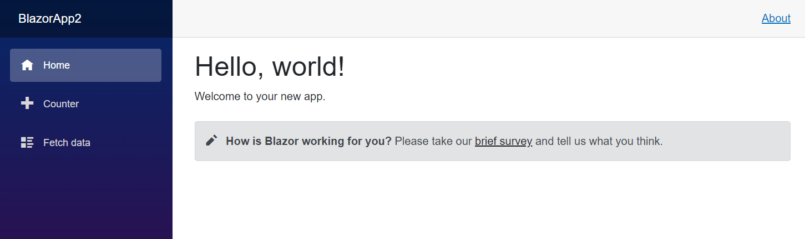
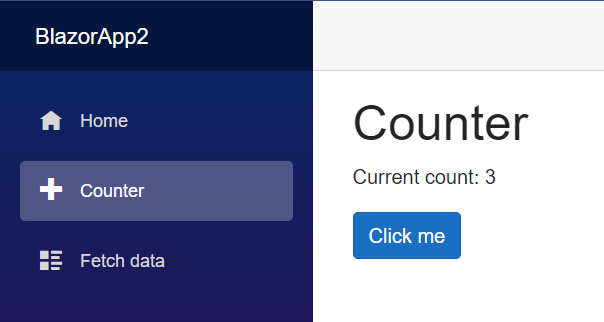
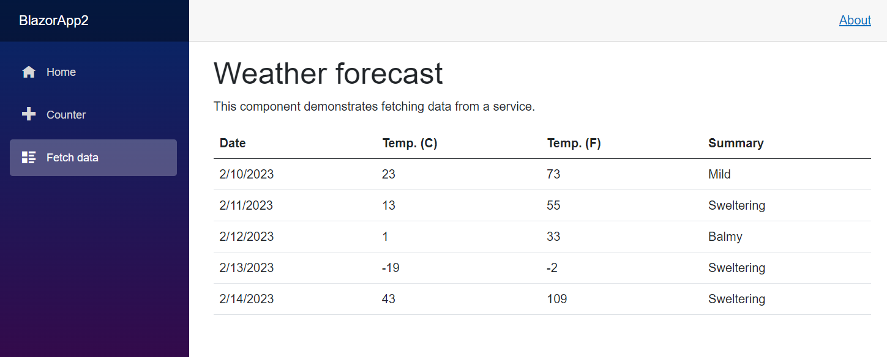
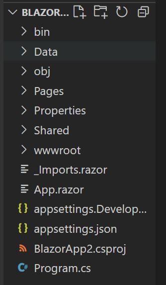
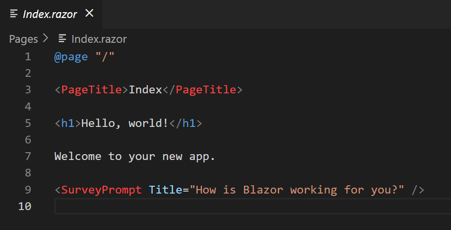
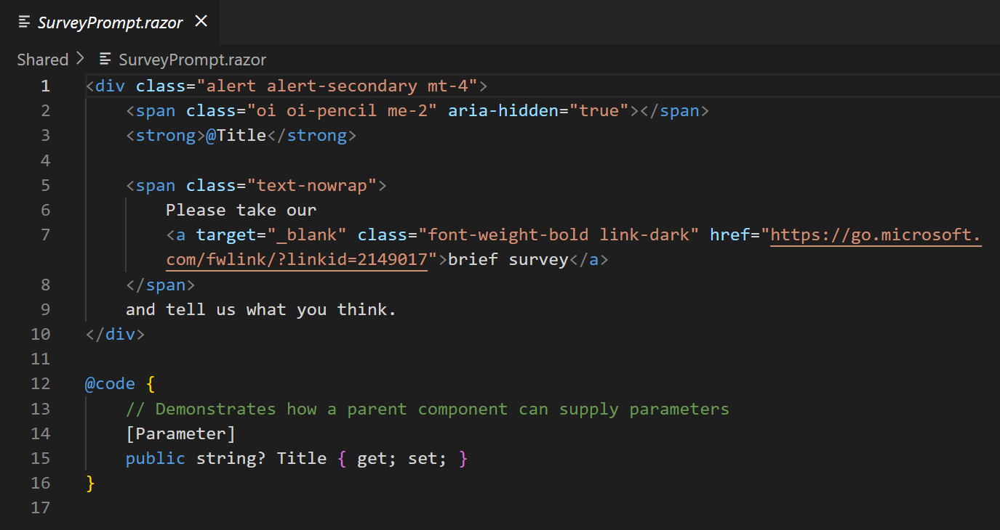

# C# and Blazor

[Blazor](https://dotnet.microsoft.com/en-us/apps/aspnet/web-apps/blazor) (also known as Blazor WebAssembly) is .NET's version of the popular Single-Page Application (SPA) framework. SPAs quickly rose in popularity from their initial creation for their vast improvements to user experience thanks to faster load times, better compatibility with older browsers, and overall ease of use for users.

One of the most popular SPAs out there, which you are likely familiar with, is React, a JavaScript SPA that has grown to become [one of the most popular frameworks](https://gist.github.com/tkrotoff/b1caa4c3a185629299ec234d2314e190) in use today.

However, while integrating React into a C# application is entirely doable (and covered later in this chapter), it cannot be denied that for developers looking to reduce the number of languages being used in a single project at once, Blazor becomes a useful tool for one reason: we are able to create SPAs with C# and Razor operating our front-end instead of having to know C# and JavaScript.

Disclaimer: Though it is true that using Blazor will reduce the need to know multiple languages for a project, it must be noted that by and large React and other SPA frameworks are still considered superior to Blazor. It has been noted in many reviews that, by comparison, Blazor falls short of React in many ways, especially when comparing the speed at which the applications run. However, Blazor is still a viable framework to know and use, and given its relative newness (Blazor was released in 2018, whereas React was released in 2013), it can be noted that Blazor has room to grow into a stable competitor to React and other SPA frameworks.

## Getting Started

Since Blazor was created by Microsoft, there is ample documentation available for learning the framework quickly and easily. We recommend getting started by working through Microsoft's [introductory tutorials](https://dotnet.microsoft.com/en-us/learn/aspnet/blazor-cli-tutorial/intro) on Blazor. Simply spinning up a Blazor application will start you off with working examples to make getting your first project off the ground quick and easy.

We highly recommend getting started by going through the following Microsoft tutorials. They are quick and they demonstrate the basics in an effective manner:

[Build your first Blazor app](https://dotnet.microsoft.com/en-us/learn/aspnet/blazor-cli-tutorial/intro) (note: you can ignore the part in the CLI command where it builds the project using .NET 7, if you leave the `-f net7.0` off it will create a project with the version of dotnet you have.)

[Build a web app with Blazor (Todo list)](https://learn.microsoft.com/en-us/training/modules/build-blazor-webassembly-visual-studio-code/1-introduction) 

If you have experience with React or another SPA program, you will find the concepts in Blazor extremely similar. We recommend that you take some time to compare and contrast the two to aid in your understanding of how Blazor is working.

If you have not worked with React or a SPA before, let's go over the basic parts you need to know to get your project up and running. We encourage you to compare and contrast the demonstration here to what you know about building out an MVC project in C#.

## Starting a project

The tutorials demonstrated how to get started with Blazor Server projects. In your terminal run the command `dotnet new blazorserver -o BlazorApp --no-https` (you can ignore the `-f net 7.0` in the tutorial since we are using net6.0). Once your project is created, cd into it and open it up in VS Code.

These projects come with some default code implemented that set up a few demonstrations of what is possible with a SPA. Use `dotnet watch run` and see what you get.

First, we see a basic introduction page that has some nice styling and a navbar to take us to other areas of the website.

Clicking on the "Counter" tab will leave the basic structure, but replace the middle content with a working counter that increments every time you click the button.

And finally, there's the Fetch Data tab, which shows some weather information.

Let's take a look under the hood to see where all this information and functionality is coming in from.

## A Blazor App

Opening the project in VS Code shows us a file structure that is not unlike the MVC structure we worked with throughout the course. What elements in here do you recognize?

The standout files and folders that are the same from an MVC project are bin, obj, Properties, Shared (though you will notice it lives outside of any Views folder), wwwroot, appsettings.Development.json, appsettings.json, a csproj file, and, of course, Program.cs. We can recognize over half of the files and folders our Blazor application has created. Further exploration into these files and folders will reveal there is not much changed from the projects we are used to. We will go over some of these files in detail later, but for now, let's focus on the parts we do not recognize and see if we can contextualize them.

## Data Folder

Inside the Data folder are the files `WeatherForecast.cs` and `WeatherForecastService.cs`. A peek inside WeatherForecast shows it is a model for WeatherForecast. WeatherForecastService is a file that, upon analyzing, you should recognize is automatically generating entries for an array of WeatherForecast objects. Could this be where we are creating the information seen on the Fetch Data page? (Yes.)

We do not yet have the context for how this information is being passed to our front end, but at least we have identified where our data is being generated.

## Pages

A look into the Pages folder shows a lot of `.razor`, `.cshtml`, and one `.cs` file. Based purely on the names of the files inside (`Index.razor`, `Counter.razor`, `FetchData.razor`, etc), what purpose do you think the Pages folder serves?

Hopefully, you've thought to yourself "it seems an awful lot like the Views folder in an MVC project." That would be correct! Pages function almost exactly the same way Views did, except with a few modifications. For starters, all of our files are razor files instead of cshtml files (minus a few outliers, but the main pages are all razor files).

Let's take a look at our Index page and see what we can figure out:

Line one says `@page "/"`. What do you think this means?

This line of code works the same way we used to declare routes in our Controller (`[HttpGet("")]`). This line tells our program that this is the page we would like to render when we navigate to /, or the front page, of our website.

Line three uses a special tag called a `PageTitle` and has Index in between. This is like the `<title>` tag we would use in HTML. It defines the text that displays in the tab at the top of your browser. Check out the project running again and look at your tab title. You will notice this change as you jump between pages.

Lines five and seven are pretty self-explanatory. They display the text we saw on the screen earlier.

Line 9 has another special tag called `SurveyPrompt`, and it passes in a `Title` as an attribute with some text inside. A quick look in the Pages folder shows no file called SurveyPrompt. So where is it? It's actually in the Shared folder, and you can see some extra interesting code in there.

React users, does this format look familiar to you? You should recognize the SurveyPrompt tag as a component and the Title attribute is like a prop! Let's take a look at the SurveyPrompt code found in the Shared folder to understand what is going on here.

Most of what you see is standard HTML. You can even match it to what you were seeing on the rendered front page of your Blazor app. The real difference is that `@code` block at the bottom of the page. What is it doing?

What you will notice is that Title variable is back, and it has that `[Parameter]` annotation above it. What was a parameter again? A parameter is a stand-in variable, commonly used in functions, to accept some kind of argument to fill it in. And what did we do back on Index.razor? We filled in the Title attribute! This passed the data down into our SurveyPrompt and allowed it to be rendered to this page as `@Title`  on line 3. You should notice now that the text written in for Title on Index.razor is appearing on the page.

Basically, on SurveyPrompt.razor, we created a parameter variable that could be filled in when we asked for this page to be rendered (by calling on SurveyPrompt in Index.razor). That filled-in value was passed down to our page and used as needed. This is the exact same idea as passing a prop in React, just with some different syntax and setup.

Another way to think of what we just did is that SurveyPrompt is a partial, and we told it to render within another page. We also passed data down into it by filling in a piece of information.

You are going to find a lot in programming that concepts between languages and frameworks are often the exact same, just with different words!

With everything we just covered in mind, can you look at the Counter.razor and the FetchData.razor files and piece together what is going on? Any knowledge of JavaScript you have will prove particularly useful here!

## Shared

Let's take a moment to look at a familiar folder with some unique files inside it. Shared, just like in an MVC project, is a place to store files that can be used across our website. They differ from Pages in one major way: they tend to only be a piece of a page that gets slipped into a larger page, rather than being standalone pages. You will notice that none of the files inside Shared have @page at the top. Their purpose is to slip into razor files that do represent entire pages.

SurveyPrompt is one example, but you will also notice the NavMenu we have seen on the side of the screen the whole time is in here, as well as another file called MainLayout. It also contains code we see on the page, as well as an @body that represents where all other files (including Pages) will fit into. This is our starter file, and as such we recommend not deleting this file or the @body it has. You can feel free to modify everything else about these files as much as you'd like to get the look you want for your website.

## Miscellaneous other files

The other files we do not recognize are `_Imports.razor` and `App.razor`. _Imports.razor contains several using statements that our project needs to run. In fact, doing this eliminates the need to add certain using statements to the tops of some of our files, because these statements are available globally! App.razor is simply a startup file we need that dictates what to render to start our project and what to do if a problem is encountered when trying to render our project.

## Key Takeaways

Once you have finished combing through the various files in a Blazor application, you should come away with the following conclusions:

- Pages are equivalent to Views, but the file type will be razor instead of cshtml.
- To declare the route of a file, we use @page "/pagename" at the top of the file. This eliminates the need to make a controller that decides this.
- C# logic is written inside an @code block, typically seen at the bottom of a page. But we can still use the @ anywhere else in our project, the same way we did in previous projects.
- We can pass data down from one razor file to another using the [Parameter] keyword in the receiving file's code block and then fill in the data as an attribute when calling the component we want to render.
- C# can work with events like onclick to trigger functions (written in the @code block).
- We can create Data objects that contain lists of data we can access and render on a page. (Imagine doing this, but with a proper API connected!)

This is enough information to get you started on making your own Blazor projects. Given its emphasis on front end, it could be a fun framework to try to build something that relies more on front end design than back end, like a portfolio or profile page, or something that renders data taken from a JSON or external source.

The big draw of SPAs is how reactive their user interfaces are. Leverage this and really go all out in building a website that is front end heavy. This is a great chance to test your design and logic skills, so have fun with it and learn by experimenting! Happy coding!