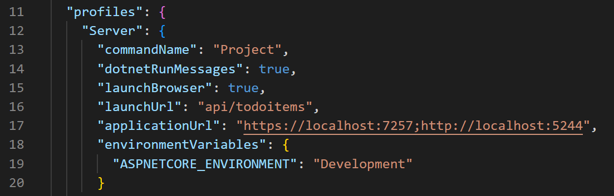

# C# and React

Building a web application does not require that the front and back ends be written in the same language. It is convenient, but being able to pick and choose your technologies of choice for the front and back end allows you to take advantage of the best of both languages. Today, we will cover how to connect a React (JavaScript) front end to a C# back end by creating a Todo List application (an application in which a user can create tasks they need to do, mark those tasks as complete, and delete the tasks).

Important! This tutorial assumes you have knowledge of React and axios. This tutorial is written using **React 18.2.0**, **axios 1.3.3**, and **NET 6**. Please be aware that updates to any of these technologies may cause inconsistencies in the tutorial.

This is a lengthy demo as it takes you from the ground up on building a full CRUD application. Strap in and prepare to learn a lot!

## Getting Started

The first thing we need to start our project is a folder to hold everything together. We will be creating separate front and back end projects, so they need a folder to house them together. To get started, navigate to wherever you would like your project to live on your computer and create a new folder called TodoList.

## Setting up C# backend

Navigate inside your project folder and create your C# back end using the following line:

`dotnet new webapi -o Server`

Notice we will not be using the `--no-https` flag here. Our project will make use of https for its api route.

Navigate into the Server folder. We must now run a command to trust our now HTTPS development cert. In running this line, you may have a prompt appear. Click "yes" if it appears. If a prompt does not appear, it means you have previously told your computer to trust HTTPS certs from your device.

`dotnet dev-certs https --trust`

If you run into any issues running this command or getting your computer to trust your HTTPS cert, use this [link](https://learn.microsoft.com/en-us/aspnet/core/tutorials/first-web-api?view=aspnetcore-6.0&tabs=visual-studio-code#test-the-project-1) to help troubleshoot.

Next, we must install the packages we need to use Entity Framework Core and MySQL. These are the same commands from earlier in the course we use, and much of the connection process will look the exact same as it did previously.

```csharp
dotnet add package Pomelo.EntityFrameworkCore.MySql --version 6.0.1
dotnet add package Microsoft.EntityFrameworkCore.Design --version 6.0.3
```

Now we can open the project in VS Code to start making adjustments.

## Preparing for our Project

Upon opening your Server folder, you will notice that there are references to WeatherForecast throughout. This is because a webapi project spins up with a WeatherForecast demonstration by default. We will not need these files, so you can delete WeatherForecast.cs and WeatherForecastController.cs from the project.

The next change we need to make is inside of Properties > launchSettings.json. Around line 16 you should see "launchUrl" set to "swagger". We will replace "swagger" with "api/todoitems", like so:



This will become the base route we will use to call on our API. Notice how because we are using HTTPS there are two localhost ports listed in "applicationUrl" now. One is the 5XXX port we are familiar with, and the other is a 7000 port. This 7XXX port is our HTTPS route. Remember it, because it will be coming in handy later. You will most likely have a different 7000 port than the one shown above.

## Making a Todo class

Next, we can create our model for our Todo item. Start by making a Models folder in your project, then create TodoItem.cs. Inside it, we will create our basic Todo model. All we need is a name for the task we want to do and whether or not the task is completed (and of course an id).

```csharp
#pragma warning disable CS8618
using System.ComponentModel.DataAnnotations;
namespace Server.Models
{
    public class TodoItem
    {
        [Key]
	public long Id { get; set; }
	[Required]
	public string Name { get; set; }
	// Default to false because we wouldn't add something to our list that's already done
	public bool IsComplete { get; set; } = false;
    }
}
```

## Estabilishing a connection with our database

Once your model is ready to go, the next part is to set up your Context file. Also in Models, create a file called TodoContext.cs and add the following code. It won't look much different from the code you've written before.

```csharp
using Microsoft.EntityFrameworkCore;
namespace Server.Models
{
    public class TodoContext : DbContext
    {
        public TodoContext(DbContextOptions<TodoContext> options) : base(options) { }
        public DbSet<TodoItem> TodoItems { get; set; } = null!;
    }
 }
```

Next, we need to establish our connection string in `appsettings.json`, exactly the same way we used to:

```csharp
"ConnectionStrings":    
{        
    "DefaultConnection": "Server=localhost;port=3306;userid=root;password=root;database=todolistdb;"    
}
```
Don't forget to update your credentials to your personal login information if needed!

The final step in our setup is to do some work in Program.cs. We need to get our server connected as well as add some CORS features in to allow our front end to talk to our back end server. See the example code below and match your Program.cs to what is shown:

```csharp
// Added using statements
using Microsoft.EntityFrameworkCore;
using Server.Models;
var builder = WebApplication.CreateBuilder(args);
// Added connection string
var connectionString = builder.Configuration.GetConnectionString("DefaultConnection");
builder.Services.AddControllers();
// Add cors
builder.Services.AddCors(options =>
{
    options.AddDefaultPolicy(
        policy =>
        {
            policy.AllowAnyOrigin().AllowAnyHeader();
        }
    );
});
// Add MySQL connection
builder.Services.AddDbContext<TodoContext>(options =>
{
    options.UseMySql(connectionString, ServerVersion.AutoDetect(connectionString));
});
// Comment these out
// builder.Services.AddEndpointsApiExplorer();
// builder.Services.AddSwaggerGen();
var app = builder.Build();
// Configure the HTTP request pipeline.
if (app.Environment.IsDevelopment())
{
    // Add this
    app.UseDeveloperExceptionPage();
    // Comment these out
    // app.UseSwagger();
    // app.UseSwaggerUI();
}
app.UseHttpsRedirection();
app.UseAuthorization();
// Add this line
app.UseCors();
app.MapControllers();
app.Run();

```

With that done, the final step is to migrate our work to MySQL (`dotnet ef migrations add FirstMigration` and `dotnet ef database update`). If you encounter any errors, double-check your work or run the add migrations command in verbose mode to see what the issue is. You can verify by looking into MySQL workbench that everything migrated correctly. If you're all set, the next phase is to start writing logic to add and fetch data from our database.

## Creating and Reading

Our C# backend is going to function solely as a means of communicating with our database using API calls. React will handle everything our front end needs, including routing, retrieving data with axios, and rendering it all for our users. Nothing we make in our C# back end is going to dictate what pages render at what time and what happens when they do render. The controller we are about to build is purely designed to retrieve data from MySQL and respond to requests for data with JSON data.

To get started, we need to make a new file in the Controllers folder called TodoItemsController.cs. Below we have provided some starter code for this file:

```csharp
using Microsoft.AspNetCore.Mvc;
using Microsoft.EntityFrameworkCore;
using Server.Models;
namespace Server.Controllers
{
    [Route("api/TodoItems")]
    [ApiController]
    public class TodoItemsController : ControllerBase
    {
        private TodoContext _context;
    	public TodoItemsController(TodoContext context)
    	{
    	    _context = context;
    	}
    }
}
```

The major differences you should notice from the controllers we are used to writing are the inclusion of `[ApiController]` and the presence of a `[Route("api/TodoItems")]` at the top of our controller. Remember earlier in our launchSettings how we changed the launchUrl to "api/todoitems"? Here we are establishing that base route which will be used for all of our api calls within this controller. Basically, for every route we create in this controller now, there is an implied /api/todoitems leading it. You will see this in action soon. The `[ApiController]` is there to dictate the fact that this controller exists to be an API for our project and requires us to use API routes.

## Get all Todo Items

Our first route will retrieve and return a list of all our Todo items from the database. Conceptually, it will work the same way we have done it in the past, but there are a couple of modifications to make to account for this route only existing to return data rather than a View. See the code below for a demonstration:

### TodoItemsController.cs
```csharp
// code above removed for brevity
[HttpGet]
public async Task<ActionResult<IEnumerable<TodoItem>>> GetTodoItems()
{
    return await _context.TodoItems.ToListAsync();
}
// code below removed for brevity
```

Major notes:

- We did not have to specify a route at the top because the base route covers where we need to go (/api/todoitems to retrieve all the items).
- The return type is a lot bulkier than what we're used to seeing. It is what dictates what we are expecting back. In this case, an IEnumerable collection of TodoItems.
- We are writing our query and returning it on the same line for brevity. This query goes into our database and puts all our TodoItems into a list. Async is mentioned throughout since it is an API call.

## Get One Todo Item

We can follow much of the same logic to retrieve one item from our list. This route will require us to specify an addon to our route so that we can know exactly which task we are trying to access. We will also include some logic to ensure we have a task to present before sending it along.

### TodoItemsController.cs

```csharp
// code above removed for brevity
// Notice we specify the need for an id here. The whole route would be /api/todoitems/2 for example
[HttpGet("{id}")]
public async Task<ActionResult<TodoItem>> GetTodoItem(long id)
{
    // Find the item in question
    var todoItem = await _context.TodoItems.FindAsync(id);
    // Check to see if we got back null, in which case return NotFound
    if (todoItem == null)
    {
        return NotFound();
    }
    // Otherwise, return the item
    return todoItem;
}
// code below removed for brevity
```
## Creating a Todo Item

There isn't much use to getting todo items if there is nothing to get! Next, we will cover how to add items to the database. As usual, creating an item will require us to go through a post request. We can also validate our form the same way we used to. Beyond that, however, the code will begin to differ:

```csharp
// code above removed for brevity
[HttpPost]
public async Task<ActionResult<TodoItem>> PostTodoItem([FromBody] TodoItem todoItem)
{
    if (ModelState.IsValid)
    {
    	_context.TodoItems.Add(todoItem);
    	await _context.SaveChangesAsync();
    	// This uses the GetTodoItem route we wrote above
    	return CreatedAtAction(
    		nameof(GetTodoItem),
    		new { id = todoItem.Id },
    		todoItem);
    } else {
    	// This is what will allow us to get error messages for our front end
    	return BadRequest(ModelState);
    }
}
// code below removed for brevity
```
Major notes:

- The post route does not include any extra routing, meaning it goes to /api/todoitems. Since it triggers a post request, it knows the difference between this action and the action that gets all of our todo items (a get route).
- When we receive our data, we need to pull it from our form using [FromBody].
- Adding to the database is the same, but our SaveChanges is happening asynchronously.
- We return a created action with our new item inside.
- If we failed our validations, we return a BadRequest with our ModelState inside so that we can catch and render the errors. This will be fully demonstrated when we move over to React.

With all our setup done for now, the next step is to create our front end! We will return to our back end after we have set up the front end and verified we are able to create and read data. Then we will add the ability to update and delete our todo items.

## Starting our React project

In your terminal, make sure you are located in the root folder of your project (not inside the Server folder). We will now create our React application.

`npx create-react-app client`

Navigate into the client folder and install axios. You may also take the opportunity to add any styling packages you would like, such as bootstrap, at this time.

`npm i axios bootstrap`

With that complete, we recommend navigating back one step and opening the entire project up in VS Code. If you were previously working with just the Server folder open, close VS Code, and reopen from your root folder so you have quick access to your front and back ends now.

## Adding a Form

Step one will be to make a form for adding items to our database. To get started, make a components folder in your src folder, and then make a file called TodoForm.jsx. As mentioned previously, this tutorial assumes knowledge of React, so we will not be going into detail on much of what is happening in this file except where it deviates in order to work with our C# backend.

```jsx
import { useState } from "react";
import axios from "axios";
const TodoForm = props => {
    const [form, setForm] = useState({
        name: "",
	isComplete: false
    });
    const [errors, setErrors] = useState(null);
    const onChangeHandler = e => {
	setForm({...form, [e.target.name]: e.target.value})
    }
    // This empties the form after you submit
    const formReset = () => {
	setForm({
	    name: "",
	    isComplete: false
	})
    }
    const formHandler = async e => {
	e.preventDefault();
	// try to add the item, otherwise, get errors
	try {
	    const addItem = await axios({
	        url: "https://localhost:7257/api/todoitems",
	        method: "post",
	        data: form,
	        contentType: "application/json"
	    });
	    // Clears the form
	    formReset();
	    // Resets errors to null in case there had been some
	    setErrors(null);
	} catch (err) {
	    // Only Name is capable of getting an error
	    // Pull one layer back if you have multiple errors to watch out for
	    setErrors(err.response.data.errors.Name);
	}
    }
    return(
	<>
	    <h2>Add a Task</h2>
	    <form onSubmit={formHandler}>
	        <div>
	            <label htmlFor="name">Task:</label>
	            <input type="text" name="name" onChange={onChangeHandler} value={form.name} />
	            <div>
	                {errors ? <span className="text-danger">{errors}</span> : ""}
	            </div>
	        </div>
	        <div>
	            <input type="submit" value="Add Task" />
	        </div>
	    </form>
	</>
    );
}
export default TodoForm;
```

The only major change here is when the form is submitted. To account for our back end ModelState errors, we move into a try/catch statement, where we try to add our item to the database using the post route from our controller, and otherwise catch our errors and set them into an object for rendering. When we call on axios, we pass along the url we want to talk to, the method type (post here), the data to pass along (the form we filled out), and the content type. This will send the data to our C# back end where it will either accept the information and add it to the database or reject it and give us back error messages.

With your form ready to go, add the component to App.js (also be sure to import your styling, this example has some bootstrap styling written in). It's time for our first test!

## Testing our Connection

To run the project, you will need to open two terminals. One runs the back end and the other runs the front end. We recommend spinning up the back end before the front end. In your back end terminal, use `dotnet run`. In your front end terminal, use `npm start`. React should open the browser up for you and you should now see your form. If you do not, double-check your work.

Use the form to add a todo item. If everything is set up correctly, it should add it to your database. Check MySQL Workbench to verify this. If it worked, congrats! If it did not, go back through the steps to verify they have been followed accurately.

If everything is working properly, the next step is to render the data to the page.

## Rendering the List

Inside the components folder, create a new file called GetTodos.jsx. This is where we will render the list of Todo items, but we will also place the form inside it as well to make things easy. You are free to move components around in whatever way you would like!

The logic and axios call used on this page are used in a standard way. Nothing special needs to be noted for this page. Do take notice of how the axios call is getting updated in the UseEffect though, and be sure to add `props.TriggerUpdate()` into your form's submit handler after a successful axios call. Right above the call for `FormReset()` would be a good spot for it.

```jsx
import { useEffect, useState } from "react";
import axios from 'axios';
import TodoForm from "./TodoForm";
const GetTodos = props => {
    const [allTasks, setAllTasks] = useState(null);
    const [update, setUpdate] = useState(false);
    useEffect(() => {
	axios.get("https://localhost:7257/api/todoitems")
	     .then(res => setAllTasks(res.data))
    }, [update])
    // This will be what tells the list of all todos to update
    const triggerUpdate = () => {
	setUpdate(!update);
    }
    return(
	<>
            <h2>My Todo List</h2>
            {
                allTasks ? allTasks.map((item, i) => <div key={i}>
                    <h4>
	                {item.name} 
	                <input type="checkbox" name="isComplete" checked={item.isComplete}/> 
	            </h4>
	        </div>)
	        : <h3>Loading...</h3>
	    }
	    <TodoForm triggerUpdate={triggerUpdate}/>
        </>
    );
}
export default GetTodos;
```

Don't forget to update App.js with the GetTodos component! Then spin up both sides of your project again if you shut them down and test it out. Now when you add an item to the list, it should update the displayed list!

## Updating Todo Items

Now that we can create and see our todo tasks, the next step is to be able to check off that a task is done. This will require us to update the IsCompleted field from true to false.

First, we must turn our attention back to the back end. Head over to TodoItemsController. There is a little function we are going to need to write to assist us here. It checks whether or not an item exists in our database and returns true or false based on the results. We will need this because we won't want to try to update something that doesn't exist!

At the bottom of your controller logic, you can add the following code:

```csharp
private bool TodoItemExists(long id)
{
    return _context.TodoItems.Any(e => e.Id == id);
}
```

Now we are ready for our update action. For this action, we are going to call on another post route (not put or patch) and add some information to our route so it knows which post request we want to trigger.

```csharp
[HttpPost("update/{id}")]
public async Task<IActionResult> UpdateTodoItem(long id, [FromBody] TodoItem todoItem)
{
    // If the id from the route doesn't match the id of the item we passed along, throw a bad request
    if (id != todoItem.Id)
    {
        return BadRequest();
    }
    // Find the original item
    var originalTodoItem = await _context.TodoItems.FindAsync(id);
    // Verify the original item exists
    if (originalTodoItem == constant language from-rainbow">null)
    {
        return NotFound();
    }
    // Added to update item
    originalTodoItem.Name = todoItem.Name;
    originalTodoItem.IsComplete = todoItem.IsComplete;
        
    try
    {
        await _context.SaveChangesAsync();
    }
    catch (DbUpdateConcurrencyException) when (!TodoItemExists(id))
    {
        return NotFound();
    }
    return NoContent();
}
```

The logic here presents several layers of security so that we do not update the wrong piece of data or data that does not exist. Take some time to go over the code provided to understand what it is doing. Now that you have seen many of these elements in play already, they should feel familiar.

We can now head back over to our React client to add the logic for triggering an update. The trigger will be the checkbox we created previously. When this is checked (or unchecked) it should trigger the update call.

First, let's update the checkbox in GetTodos.jsx:

```jsx
// other code
<input type="checkbox" name="isComplete" checked={item.isComplete} onChange={() => onChangeHandler(item)}/>
```
We created an onChangeHandler for this situation. Now we need the logic for it to trigger the change:

```jsx
// other code
const onChangeHandler = async item => {
    item.isComplete = !item.isComplete;
    try {
        const updateItem = await axios({
            url: `https://localhost:7257/api/todoitems/update/${item.id}`,
            method: "post",
            data: item,
            ContentType: "application/json"
        });
        // Need to update our list with the proper information
        setUpdate(!update);
    } catch (err) {
        console.log(err);
    }
}
```
Be sure to restart your back end since you made changes to the controller. If you test it out everything should be working!

If you'd like to add some extra visual flare to your project now to clearly show which items are done and which ones are not, add this code to App.css

```css
.success {
	background-color: rgb(81, 173, 81);
	padding: 5px;
	margin: 2px;
	color: white;
}
.todo {
	background-color: rgb(227, 63, 63);
	padding: 5px;
	margin: 2px;
	color: white;
}
```
And then in GetTodos.jsx you can add the two styles into a ternary:

```jsx
<h4 className={item.isComplete ? "success" : "todo"}>
    {item.name} 
    <input type="checkbox" name="isComplete" checked={item.isComplete} onChange={() => onChangeHandler(item)}/> 
</h4>
```

Now you have some extra visuals to tell what is done and what is not! Feel free to style this to your taste.

## Deleting Todo Items

The final step in all of this is to get delete working. As before, we will first turn our attention back to TodoItemsController.cs to add our delete logic. The logic itself is very straightforward: find the item by its id, verify that it exists, then remove it from the database and save the changes. Like with update, this will be done with a post request.

```csharp
[HttpPost("delete/{id}")]
public async Task<IActionResult> DeleteTodoItem(long id)
{
    var todoItem = await _context.TodoItems.FindAsync(id);
    if (todoItem == null)
    {
        return NotFound();
    }
    _context.TodoItems.Remove(todoItem);
    await _context.SaveChangesAsync();
    return NoContent();
}
```

Back in the React client we need a button to trigger the delete method and pass along the information about which item to delete. The button can be passed in with the map of all the items to make things easy.

```jsx
<button onClick={() => deleteItem(item.id)}>Delete</button>
```

Finally, we need the logic to run when we click the button. This will trigger an axios call to the delete action and trigger the list to update so it is visually removed from the list.

```jsx
// other code
const deleteItem = async id => {
    try {
	const removeitem = await axios({
	    url: `https://localhost:7257/api/todoitems/delete/${id}`,
	    method: "post",
	    ContentType: "application/json"
	});
	setUpdate(!update);
    } catch (err) {
	console.log(err);
    }
}
```
Test it out and everything should be in working order! Congratulations! You've build a full CRUD application with a React front end and a C# back end! We recommend taking the time to add your own css styles and some of your own logic to it. How can you take this project to the next level? Better yet, how can you take what you learned here to build your own project? The possibilities are endless!

If you need to see a working example of this demo, you can find the repository for it [here](https://github.com/NicholeKing/CSharp_React_Todo_List).